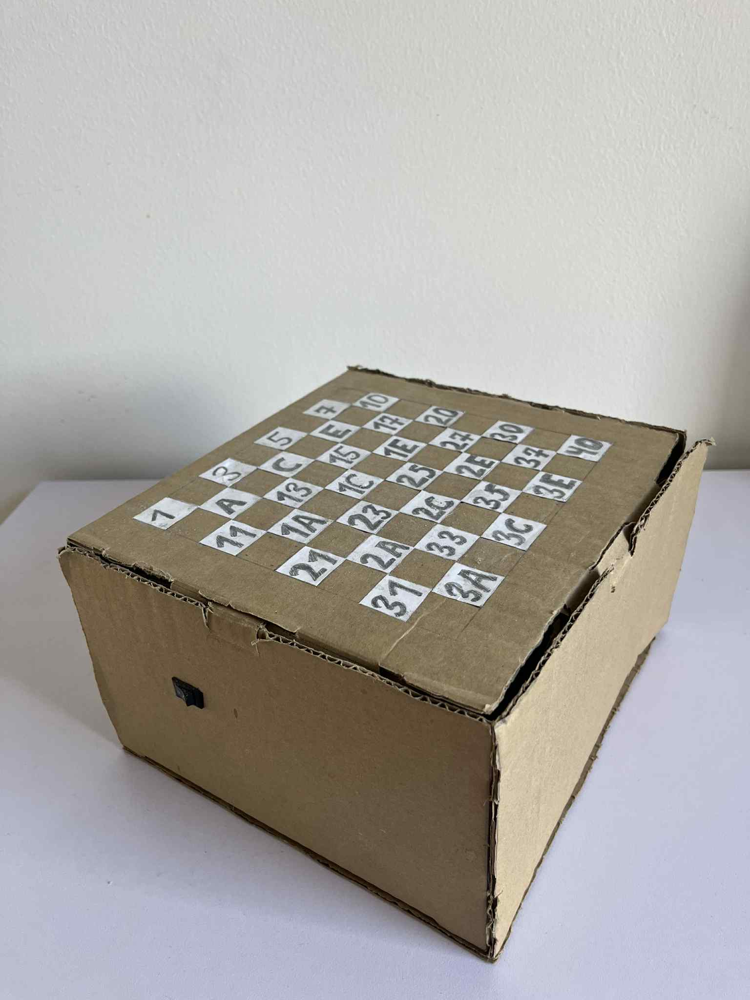

# stm32-electronic-checkers-game
Interactive LED checkers game built with STM32 microcontroller and Bluetooth connectivity.

## Features
- Full LED-based game board representing two players (red and blue LEDs)
- Real-time piece movement: LEDs turn on, off, and blink according to game state
- Bluetooth connectivity via HC-05 modules for smartphone control
- Powered by a Lithium-ion battery
- Modular and maintainable C code structure

## Technical Overview
- **Microcontroller:** STM32F446 Nucleo (HAL-based)
- **Language:** C
- **Communication:** 
  - STM32 ↔ HC-05 Bluetooth module via UART with DMA
  - HC-05 ↔ Smartphone via standard Bluetooth serial
- **LED Control:** Direct GPIO manipulation
- **Core Code Structure:**
  - `main.c` → game logic, Bluetooth input, LED updates
  - `LED_control.c/.h` → controls LED states: on, off, blink, and color detection

## How It Works
1. **Initial Setup:** LEDs are initialized to display the starting board state (red on one side, blue on the other)
2. **Player Move:** Players send the **LED number** of the piece they want to move from their smartphone using a **Bluetooth serial terminal app**. Numbers are sent as HEX values corresponding to board positions
3. **LED Update:** The STM32 receives the LED number via UART and updates the LEDs:
   - Blink the selected piece.
   - Move it to the new position.
   - Turn off any captured opponent pieces.
4. **Next Turn:** The system resets and waits for the next LED number

## Hardware
- **PCB:** Blank PCB with soldered LEDs
- **Microcontroller:** STM32F446 Nucleo
- **Power:** Lithium-ion battery
- **Bluetooth:** Two HC-05 modules

## Future Improvements
- Add a scoring system to track player points
- Implement automatic rule checking (valid moves, captures)
- Improve mobile interface for sending LED commands
- Optimize LED blinking animations for smoother visual effect
- Redesign hardware: replace direct GPIO LED control with shift registers for better scalability and simplified wiring

## Game board

